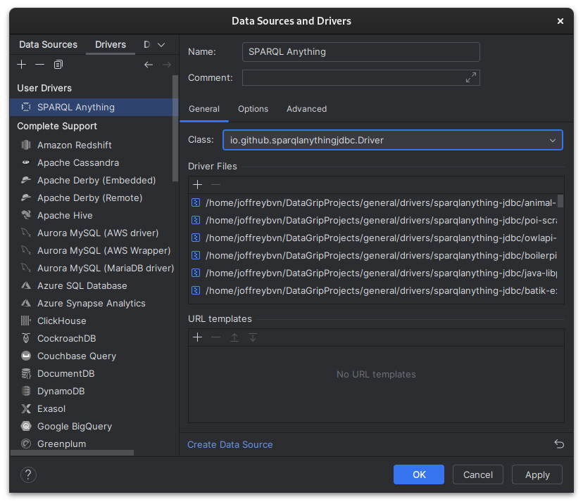
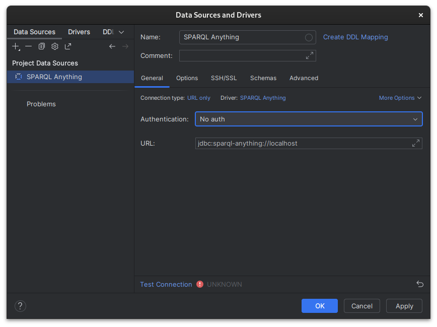
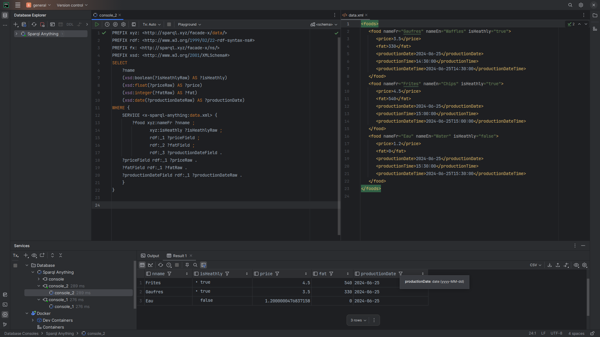

# SPARQL Anything JDBC Driver

[](https://github.com/Joffreybvn/sparqlanything-jdbc/actions/workflows/ci.yml?query=branch%3Amaster)
[](https://opensource.org/licenses/Apache-2.0)

[SPARQL Anything](https://sparql-anything.cc/) embedded as a JDBC Driver, to allow Java programs to run SPARQL queries on pretty much anything. _Currently in work in progress, expect breaking changes._

## Quickstart

➡️ See [Usage](#Usage) to set up the driver in [DataGrip](#datagrip-setup-and-usage), [DBeaver](#dbeaver-setup-and-usage), [JayDeBeApi (Python)](#jaydebeapi-setup-and-usage) and [Airflow](#airflow-setup-and-usage).

1. **Add Dependency** (if using Maven/Gradle) or drop the JAR into your classpath.
2. **Copy the [sample.xml](./sample.xml)** data locally
3. **Run a query**:

   ```java
    Class.forName("io.github.sparqlanythingjdbc.Driver");
    Connection connection = DriverManager.getConnection("jdbc:sparql-anything://localhost");
    Statement statement = connection.createStatement();
   
    ResultSet resultSet = statement.executeQuery(
        "PREFIX xyz: <http://sparql.xyz/facade-x/data/>" +
        "PREFIX rdf: <http://www.w3.org/1999/02/22-rdf-syntax-ns#>" +
        "PREFIX xsd: <http://www.w3.org/2001/XMLSchema#>" +
        "SELECT" +
        "    ?name" +
        "    (xsd:boolean(?isHeathlyRaw) AS ?isHeathly)" +
        "    (xsd:float(?priceRaw) AS ?price)" +
        "    (xsd:integer(?fatRaw) AS ?fat)" +
        "    (xsd:date(?productionDateRaw) AS ?productionDate)" +
        "WHERE {" +
        "    SERVICE <x-sparql-anything:sample.xml> {" +
        "        ?food xyz:nameFr ?name ;" +
        "               xyz:isHeathly ?isHeathlyRaw ;" +
        "               rdf:_1 ?priceField ;" +
        "               rdf:_2 ?fatField ;" +
        "               rdf:_3 ?productionDateField ." +
        "    ?priceField rdf:_1 ?priceRaw ." +
        "    ?fatField rdf:_1 ?fatRaw ." +
        "    ?productionDateField rdf:_1 ?productionDateRaw ." +
        "    }" +
        "}");
    
    int columnCount = resultSet.getMetaData().getColumnCount();
    while (resultSet.next()) {
        for (int index = 1; index <= columnCount; index++) {
            String columnLabel = resultSet.getMetaData().getColumnLabel(index);
            String value = resultSet.getString(index);
            System.out.println(columnLabel + ": " + value);
        }
        System.out.println();
    }
    connection.close();

## Features

### Supported query types

Currently, this driver focuses on SPARQL `SELECT` queries.

| Query Type    | Supported? | Description                                                                                   |
|---------------|:----------:|-----------------------------------------------------------------------------------------------|
| **SELECT**    |     ✅      | Run `SELECT` queries to find and return data matching certain patterns.                       |
| **CONSTRUCT** |     ❌      | Create/transform data based on existing data. _Not implemented yet_.                          |
| **ASK**       |     ❌      | Return `true`/`false` indicating whether a pattern exists in the data. _Not implemented yet_. |
| **DESCRIBE**  |     ❌      | Return RDF data describing a resource. _Not implemented yet_.                                 |

### Type mapping

Currently supported list of typings and their mappings to Java and SQL types. Feel free to open an [Issue](https://github.com/Joffreybvn/sparqlanything-jdbc/issues) or a [Pull Request](https://github.com/Joffreybvn/sparqlanything-jdbc/pulls) to add/request new ones.

| **XSD Type**   | **Java Class**        | **SQL Type** (`java.sql.Types`) |
|:---------------|:----------------------|:--------------------------------|
| untyped        | `String.class`        | `VARCHAR`                       |
| `xsd:float`    | `Float.class`         | `FLOAT`                         |
| `xsd:double`   | `Double.class`        | `DOUBLE`                        |
| `xsd:int`      | `Integer.class`       | `INTEGER`                       |
| `xsd:long`     | `Long.class`          | `BIGINT`                        |
| `xsd:short`    | `Short.class`         | `SMALLINT`                      |
| `xsd:byte`     | `Byte.class`          | `BINARY`                        |
| `xsd:boolean`  | `Boolean.class`       | `BOOLEAN`                       |
| `xsd:string`   | `String.class`        | `VARCHAR`                       |
| `xsd:anyURI`   | `URI.class`           | `VARCHAR`                       |
| `xsd:decimal`  | `BigDecimal.class`    | `DECIMAL`                       |
| `xsd:integer`  | `BigInteger.class`    | `BIGINT`                        |
| `xsd:date`     | `java.sql.Date`*      | `DATE`                          |
| `xsd:dateTime` | `java.sql.Timestamp`* | `TIMESTAMP`                     |
| `xsd:time`     | `java.sql.Time`*      | `TIME`                          |

**Notes:**

- The driver do the best effort to convert types. _E.g._: You can `getInt()` an untyped String to parse it and getting it as int.
- For `DATE`, `TIMESTAMP` and `TIME`, driver tries to convert first to `java.sql.Date`, `java.sql.Timestamp` and `java.sql.Time` respectively. If impossible, it falls back to String.

## Usage

### DataGrip setup and usage

Quick guide on how to add the driver to Jetbrains' [DataGrip](https://www.jetbrains.com/datagrip/) and run a SPARQL query.

1. Download the JDBC driver bundle.<br>
   **Alternatively**, clone this repository and run `make build` and `make dependencies`. Then place the generated _target/sparql-anything-jdbc.jar_ into _target/dependency_.
2. Open DataGrip, navigate to the _Database Explorer_, and click on _New_ > _Driver_.
3. Configure the driver:
   - Click on _New Driver_, name it "_SPARQL Anything_".
   - In _Driver Files_, click on _Add_ > _Custom Jars_ and select all the jars previously downloaded.
   - In the _Class_ dropdown field, select `io.github.sparqlqnythingjdbc.Driver`
   - _Apply_
   
   
5. Create a Data Source:
   - Click on _New_ > _Data Source_
   - Select the "_SPARQL Anything_" driver
   - Set the Connection URL to `jdbc:sparql-anything://localhost`
   
   
6. Open a new console and run a query

   

### DBeaver setup and usage

### JayDeBeApi (Python) setup and usage

### Airflow setup and usage
